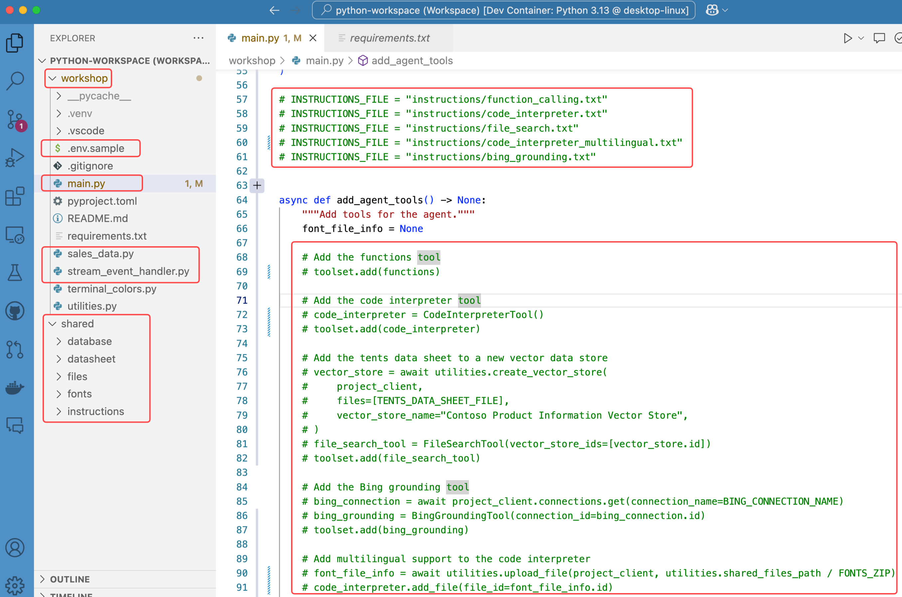

# Architecture Overview

```
User Request → AI Agent Service → APIM → Function App(s) → Backend Services
                     ↑                         ↓
                     └─────────────────────────┘
                            Response Flow
```

# Step-by-Step Setup Guide

## 1. Create the Azure AI Foundry project

1. Go to the [Azure Portal](https://portal.azure.com/).
2. Select your resource group.
3. Search for "Azure AI Foundry" and select it.
4. Create a new project or use an existing one.
5. Go to the project settings to get the connection string.
6. Add this connection string to your `.env` file as `PROJECT_CONNECTION_STRING`.

## 2. Create Environment Variables File

Create a `.env` file in the `02-agent-system/workshop` directory by copying the sample file:

```sh
cp .env.sample .env
```

## 3. Update Environment Variables

Edit the `.env` file to add the values you obtained in the previous lab:

```sh
# Azure OpenAI settings
MODEL_DEPLOYMENT_NAME=gpt-4o-mini
TEMPERATURE=0.1
TOP_P=0.1

# These values are from the 00-setup lab deployment outputs
APIM_GATEWAY_URL=https://{your_apim_instance_name}.azure-api.net
APIM_SUBSCRIPTION_KEY={your_apim_subscription_key}

# Azure AI project settings - you'll create these during this lab
PROJECT_CONNECTION_STRING={your_project_connection_string}
BING_CONNECTION_NAME={optional_bing_connection_name}
```

## 4. Project Structure

Be sure to familiarize yourself with the key subfolders and files you’ll be working with throughout the workshop.

1. The **main.py** file: The entry point for the app, containing its main logic.
2. The **enza_data.py** file: The function logic to execute dynamic SQL queries against the SQL database through APIM and Azure Functions.
3. The **stream_event_handler.py** file: Contains the event handler logic for token streaming.
4. The **shared/files** folder: Contains the files created by the agent app.
5. The **shared/instructions** folder: Contains the instructions passed to the LLM.



# Labs

| Labs                                 | Documentation                                            |
| ---------------------                | -------------------------------------------------------- |
| 1. Function Calling Power            | [Guide](./01.function-calling.md)                        |
| 2. Grounding with Documents          | [Guide](./02-grounding-with-documents/README.md)         |
| 3. Intro to the Code Interpreter     | [Guide](./03-intro-to-code-intrerpreter/README.md)       |
| 4. Grounding with Bing Search        | [Guide](./03-advanced-scenarios/README.md)               |
| 5. Advanced Scenarios                | [Guide](./04-closing/README.md)                          |
